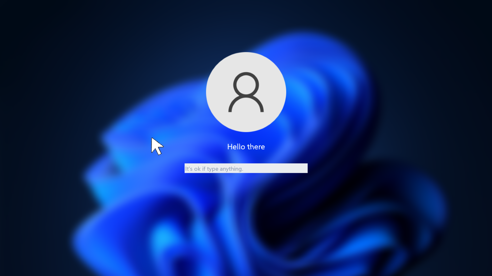
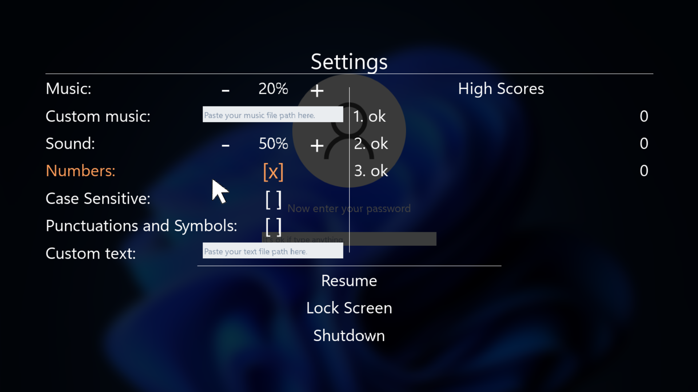
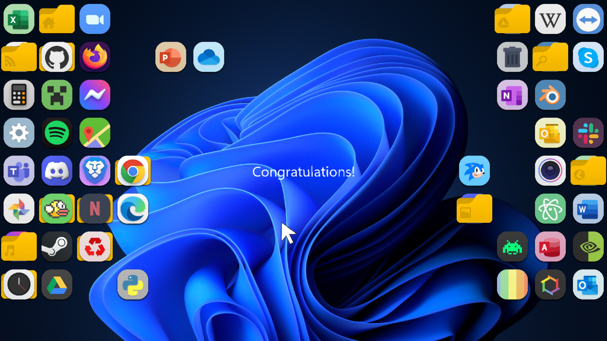
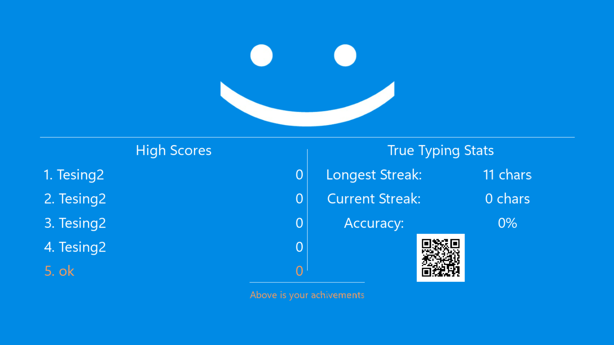
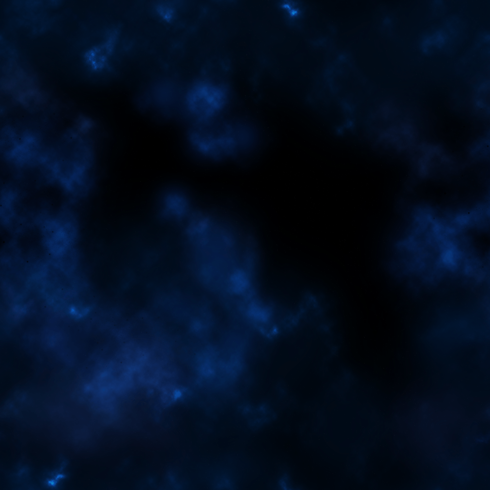
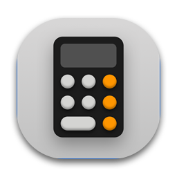
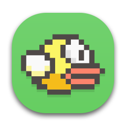
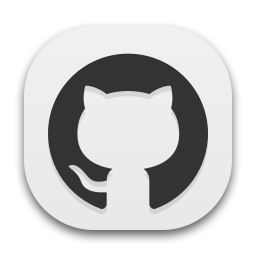
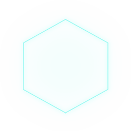
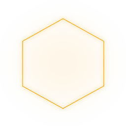

# Introduction

**Fix Your PC** is a Roguelike Game inspired by [ZType](https://zty.pe/), you will have to destroy enemies by typing **the fastest and most accurate** words, sentences, and even paragraphs that appear on the screen. Try to survive to the end and break the game or die and never go on again! Watch the demo video [here](https://youtu.be/q5CiqMmyghU?si=B3q46iarJAa-8bw1)

# Steps to download the game

At [this download page](https://github.com/PhDoanh/fix-your-pc/releases/tag/v0.1.0), you have two options:

## 1. Run the game directly

*For those who just want to experience the game*

- **Step 1**: Download and extract the `Fix-Your-PC.zip` file (~134MB)
- **Step 2**: In the unzipped folder, run `main.exe` to start playing!

## 2. Compile code to run the game

*For those who want to explore and learn about how games work through source code*

- **Step 1**: Download and extract one of the files named `Source code`
- **Step 2**: Make sure you have enough of the below before proceeding:
	- [C++ compiler](https://gcc.gnu.org/)
	- [GNU Make](https://www.gnu.org/software/make/)
- **Step 3**: Open a command prompt (e.g. cmd) in the folder containing the Makefile and type the `make` command

> Note:
> After calling `make`, the program will compile itself and run the **game** (exe file) created by it, so you don't need to enable it manually

# How to play

## Game start

When you first enter the game, you will need to provide your name to save your achievement stats as a hidden password string. In this section, you can also customize the settings in advance by pressing the **"Esc"** key

|  |  | 
|:-----------------------------------:|:---------------------------------------:|
| Enter the player's name (Game menu) |   Customize settings (Game settings)    |

The specific game setup is as follows:

- **Music**: Fine-tune the volume of the game background music
- **Custom music**: Customize the background music
- **Sound**: Fine-tune the volume of sound effects
- **Numbers**: Allows numbers to appear in typed text
- **Case Sensitive**: Allows to distinguish between uppercase and lowercase letters
- **Punctuations and Symbols**: Allows characters that are not numbers or letters
- **Custom text**: Customize the text typed in the screen

## Game play

Hold down the **"Alt"** key with **W, A, S, D** to move, release **"Alt"** and type any word or sentence you see to defeat the enemy. Over time, the difficulty level will increase in the **number, strength, and spawn time** of enemies, but if you type a certain number of characters correctly, players are allowed to unleash the **secret** by pressing **"Enter"** to easily destroy the enemy. Try not to be **hit** by enemies because the player only has a limited number of lives if they run out, the game will end with a blue screen and **automatically shut down the game**!

|  | 
|:-------------------------------------:|
|      Destroy enemies (Game play)      |

## Game over

- **Victory** if you break the entire level, the PC screen is in a normal state with congratulatory text lines. Here you can quit the game or start over if you want to set a record!
- **Defeated** if you lose all your health due to too many collisions with enemies, the blue screen of death will appear summarizing the stats you have achieved and then turn itself off for 15 seconds

|  |  |
|:-------------------------------------------:|:--------------------------------------------:|
|             Game over - Victory             |             Game over - Defeated             |

# Game Resources

## Image

**Background image**

- [Seamless Space Backgrounds by Screaming Brain Studios (itch.io)](https://screamingbrainstudios.itch.io/seamless-space-backgrounds)
- [Windows 11 All Wallpapers by wrrwenna on DeviantArt](https://www.deviantart.com/wrrwenna/art/Windows-11-All-Wallpapers-885172912)

|  |  |  |  |  |
|:--------------------------------:|:------------------------------:|:-----------------------------------:|:-------------------------------:|:-------------------------------:|
|              flower              |              full              |             full + blur             |              space              |              stars              |

**Player** *(Cursor states in PC)*

|  |  |  |  |
|:-------------------------------:|:------------------------------:|:------------------------------:|:------------------------------:|
|              arrow              |              beam              |              link              |              move              |

**Enemies** *(images only carry representative t/c)*

- [Tile OS - Part 3: Popular Apps by oviotti on DeviantArt](https://www.deviantart.com/oviotti/art/Tile-OS-Part-3-Popular-Apps-792018928)

|  |  |  |  |  |
|:--------------------------------:|:--------------------------------:|:--------------------------------:|:--------------------------------:|:--------------------------------:|
|            trash mobs            |              grunts              |            mini boss             |               boss               |            final boss            |

**Sub-objects**

|  |  |  |  |  |
|:--------------------------------:|:--------------------------------:|:-----------------------------:|:---------------------------------:|:-------------------------------:|
|          player avatar           |             bullets              |       player dead zone        |         enemy target zone         |    smile (dead blue screen)     |

## Audio

- [Search Art | OpenGameArt.org](https://opengameart.org/art-search-advanced?keys=&field_art_type_tid%5B%5D=9&sort_by=count&sort_order=DESC)
- [Free Breaking Sound Effects Download - Pixabay](https://pixabay.com/sound-effects/search/breaking/)
- [Free Click Sound Effects Download - Pixabay](https://pixabay.com/sound-effects/search/click/)

## Fonts

[Segoe UI Variable Font: Download Free for Desktop & Webfont (cufonfonts.com)](https://www.cufonfonts.com/font/segoe-ui-variable)

> Note:
> - The resources not included in the reference source are **self-designed** and available on **the windows** operating system
> - Self-designed resources based on tools: [Aseprite](https://www.aseprite.org/), [Audacity](https://www.audacityteam.org/), [Canva](https://www.canva.com/)

# Project Structure

- **inc, lib**: The directory that contains the entire SDL2 header file, source code, and associated libraries
- **res**: The folder containing the game's entire multimedia resources
	- **background**: The folder containing the background images
	- **enemy**: The folder containing all the enemy's images (50 different photos)
	- **game_data**: Game Data Storage Folder
		- **high_scores.txt**: file that saves the scores of the last 5 players (descending ranking)
		- **levels.txt**: The file saves the game's default entire level
		- **settings.txt**: The file saves the default in-game customizations
	- **music**: The folder that contains the game's default background music
	- **object**: The folder that contains the sub-objects in the game
	- **player**: Folder where images of player states are stored
	- **sound**: The folder that contains all the game sound effects
	- **SegUIVar.ttf**: the font file of the game
- **src**: The entire source code, the main logic of the game in this directory
	- **Entity.hpp, Entity.cpp**: Handling entity logic: players, enemies, bullets, etc.
	- **Event.hpp, Event.cpp**: Game interactive event management: keyboard, mouse, specific interactive functions for players, enemies, etc.
	- **Game.hpp, Game.cpp**: File containing basic logic, game engine; initialize SDL, window, renderer, game resources, delete and free up game memory, etc.
	- **Level.hpp, Level.cpp**: Manage levels; Create new levels, spawn enemies, and process characters in words that enemies keep.
	- **main.cpp**: The file contains the game's main function
	- **Screen.hpp, Screen.cpp**: file containing functions to load, draw, delete photo sprites and text
	- **Sound.hpp, Sound.cpp**: file containing functions to load, play, stop, delete background music, sound effects.
	- **UI.hpp, UI.cpp**: Manage the entire player interface in the game, Layout settings, game menu, game play, game over,...
	- **util.hpp, util.cpp**: a file that contains functions, data structures, and algorithms that provide an in-game experience.
